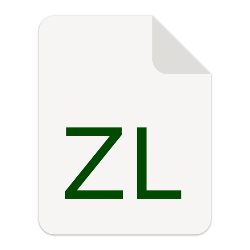

<p align="center">
  <a href="" rel="noopener">
 </a>
</p>

<h3 align="center">Zynk Lite</h3>

<div align="center">

  []() 
  [](https://github.com/Guille-ux/ZynkLite/issues)
  [](https://github.com/Guille-ux/ZynkLite/pulls)
  [](https://www.gnu.org/licenses/gpl-3.0)

</div>

---

<p align="center"> Few lines describing your project.
    <br> 
</p>

## 📝 Table of Contents
- [About](#about)
- [Currently Working On](#current)
- [Getting Started](#getting_started)
- [Usage](#usage)
- [Built Using](#built_using)
- [Authors](#authors)
- [Acknowledgments](#acknowledgement)

## 🚀 About ZynkLite

ZynkLite is a lightweight, embeddable scripting language developed in Python with plans for a high-performance C implementation. Designed for simplicity and extensibility, it features:

✔️ Native file I/O operations  
✔️ Array manipulation functions
✔️ Sleep function
✔️ Modular import system  
✔️ Clean, minimal syntax  
✔️ String & Float conversion methods

**Current Focus**:  
- Bytecode compiler development  
- Performance optimizations  
- Enhanced module system  

## 📦 Installation

### Prerequisites
- Python 3.6+
- pip package manager

### Quick Install
```bash
pip install zynk-lite
```
### Linux Mime Types (Optional)
clone git repository
```bash
git clone https://github.com/Guille-ux/ZynkLite.git
cd ZynkLite
```
move on mimes and install

```bash
cd mimes && bash install.sh
```

## Usage
### Command Line Interface (CLI)
```bash
zynkl cli # Zynk Interactive Shell
zynkl run program.zl # run a zynk program
```

### Python API
```python
from zynk_lite import interpreter as intp

zl = intp.ZynkLInterpreter(debug=True)  # Configure as needed
zl.eval('print "Hello World";')         # Direct evaluation
zl.eval_file("app.zl")                  # Run from file
```

## Key Features
- **Interpreter**: easy to debug but slow.
- **Interpreter inside**: more slow.
- **Turing Complete**: You can run enything on this.

## RoadMap
- Basic interpreter implementation

- File I/O operations

- Bytecode compiler (in progress)

- C transpiler target (if you want an extra speed)

- Standard library modules (i want to add json and csv, readers, AI too, idk)

## Documentation
Sorry, but i dont finished this yet, wait please.

## Contributing
Only make a pull request and you will be here.
(The rules can change in the future)

## ⛏️ Built Using <a name = "built_using"></a>
- [Python3](https://python.org)
- [Hatch](https://hatch.pypa.io/)

## ✍️ Authors <a name = "authors"></a>
- [@guille-ux](https://github.com/Guille-ux) - ZynkPy and ZynkLite

See also the list of [contributors](https://github.com/Guille-ux/ZynkLite/contributors) who participated in this project.

## 🎉 Acknowledgements <a name = "acknowledgement"></a>
- Readme Template from ```The-Documentation-Compendium```
